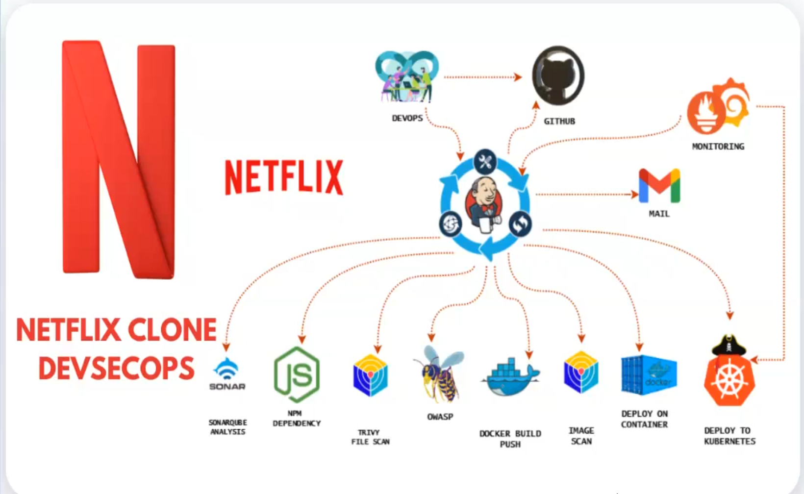

# DevSecOps Netflix Clone on AWS EKS

A production-style DevSecOps CI/CD pipeline that builds, scans, secures, and deploys a Netflix-like web app using AWS, Jenkins, Docker, Kubernetes (EKS), SonarQube, Trivy, and OWASP ZAP, Gmail, Grafana, Prometheus. This project demonstrates real-world DevSecOps practices, not just deployment.

## Project Highlights

- End-to-end CI/CD pipeline using Jenkins
- Security at every stage (container scan, owasp, sonarqube)
- Dockerized application deployed to AWS EKS
- Automated vulnerability scanning with policy-based gates
- grafana monitoring with prometheus
- terraform for infrastructure provisioning
- gmail notification for pipeline status

## Architecture Overview



Developer
  |
  | (git push)
  v
GitHub Repository
  |
  v
Jenkins CI/CD Pipeline
  |
  |-- SonarQube (SAST)
  |-- Trivy FS Scan (Dependencies)
  |-- Docker Build and Push
  |-- Trivy Image Scan
  |
  v
AWS EKS (Kubernetes)
  |
  |-- Application exposed via LoadBalancer
  |
  v
OWASP ZAP (DAST on Live App)

## Demo Video

<a href="https://drive.google.com/file/d/1sRE-pnV--9kmhuaX9gs-qmrbhdcD-Xl8/view?usp=sharing" target="_blank" rel="noopener">
  
</a>

## Tech Stack

Cloud and Infrastructure

- AWS EC2: Jenkins controller
- AWS EKS: Kubernetes cluster
- AWS ECR or Docker Hub: image registry

CI/CD and DevOps

- Jenkins: pipeline orchestration
- Docker: containerization
- Kubernetes: application orchestration

Security (DevSecOps)

- SonarQube: Static Application Security Testing (SAST)
- Trivy: dependency and container vulnerability scanning
- OWASP ZAP: Dynamic Application Security Testing (DAST)

Application

- React + Node.js
- Netflix-style frontend consuming TMDB API

## Security Integration (DevSecOps)

This pipeline enforces security at multiple layers:

| Stage | Tool | Purpose |
| --- | --- | --- |
| Code Analysis | SonarQube | Detect code smells and vulnerabilities |
| Dependency Scan | Trivy FS | Scan npm dependencies |
| Image Scan | Trivy Image | Scan OS and libraries |
| Runtime Scan | OWASP ZAP | Scan live app on Kubernetes |

Pipeline fails only for high-risk vulnerabilities, following real industry practices.

## Jenkins Pipeline Stages

1. Clean workspace
2. Checkout source code
3. SonarQube analysis (SAST)
4. Quality gate validation
5. Install dependencies
6. Trivy file system scan
7. Docker build and push
8. Trivy image scan
9. Deploy to Docker (EC2)
10. Deploy to Kubernetes (EKS)
11. OWASP ZAP scan on Kubernetes service
12. Email notification with reports

## Repository Structure

.
├── Jenkinsfile
├── Dockerfile
├── zap-rules.conf
├── Kubernetes/
│   ├── deployment.yml
│   └── service.yml
├── src/
├── public/
└── README.md

## OWASP ZAP Rules (Policy-Based)

Custom ZAP rules ensure:

- FAIL on high-risk vulnerabilities
- WARNINGS are reported but do not block delivery

Example:

```
40012  FAIL   SQL Injection
10020  IGNORE Missing Anti-clickjacking Header
```

## Automated Notifications

After every pipeline run:

- Build status email is sent
- Attached reports:
  - trivyfs.txt
  - trivyimage.txt
  - zap_k8s_report.html

## Deployment

- Application is deployed to AWS EKS
- Exposed via Kubernetes LoadBalancer
- OWASP ZAP scans the live, publicly reachable service

## Key Takeaways

- End-to-end DevSecOps flow with security gates
- Policy-driven vulnerability management
- Kubernetes + AWS EKS deployment with live DAST
- OWASP Top 10 awareness and tooling alignment
- Production-style Jenkins pipeline with audit-friendly reports

## Future Improvements

- Authenticated OWASP ZAP scans
- Security dashboards (Grafana)
- Canary or blue-green deployments
- Automated rollback on security failure
- HTTPS via Ingress + TLS

## Author

Saabiq
DevSecOps | AWS | Kubernetes | Jenkins | Security

Reach out via GitHub or LinkedIn.
